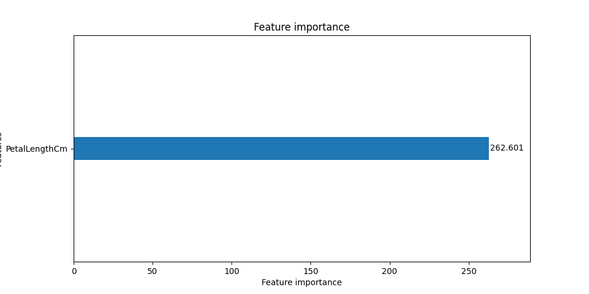

89.5% validation accuracy. Cross validating hyperparameter tuning would likely provide better results,  but this is good enough.

This model pretty much only used petal length to classify iris flowers.
